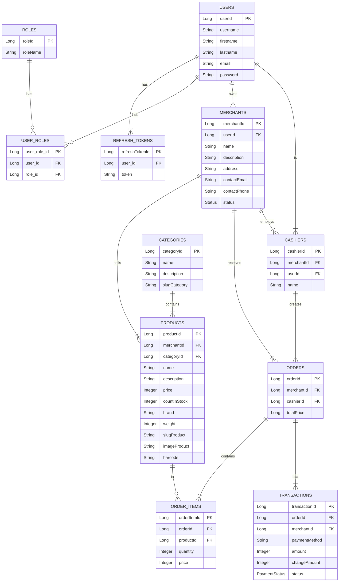
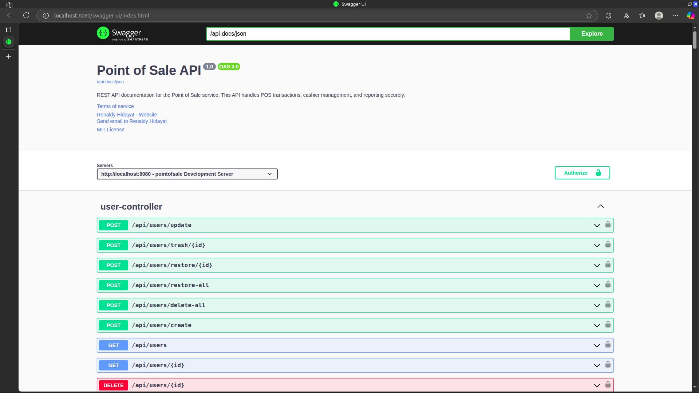

# Point of Sale (POS) API

An API for a complete Point of Sale platform built using Java and Spring Boot. This project provides the backend functionality to manage products, categories, users, orders, transactions, and more.

## Features

*   **Authentication**: User registration and login using JWT.
*   **User & Role Management**: Manage users and their access rights.
*   **Product Management**: Create, read, update, and delete products.
*   **Category Management**: Organize products into categories.
*   **Order Management**: Place orders and view order history.
*   **Transaction Management**: Process payments for orders.
*   **Merchant Features**: Onboard and manage merchants on the platform.
*   **Cashier Management**: Manage cashiers associated with merchants.

## Technologies Used

*   **Java 21**: The primary programming language.
*   **Spring Boot**: Framework for building the application.
*   **Spring Security & JWT**: For authentication and authorization.
*   **Spring Data JPA**: For database interaction.
*   **PostgreSQL**: Database management system.
*   **Maven**: Dependency management and build tool.
*   **Springdoc OpenAPI (Swagger)**: For API documentation.

## How to Run the Project

### Prerequisites

*   Java Development Kit (JDK) 21 or higher.
*   Maven.
*   PostgreSQL.

### Installation & Running

1.  **Clone this repository:**
    ```bash
    git clone https://github.com/MamangRust/example-pointofsale-springboot
    cd example-pointofsale-springboot
    ```

2.  **Database Configuration:**
    Open `src/main/resources/application.properties` and adjust your PostgreSQL database configuration.
    ```properties
    spring.datasource.url=jdbc:postgresql://localhost:5432/pos_db
    spring.datasource.username=postgres
    spring.datasource.password=postgres
    spring.jpa.hibernate.ddl-auto=update
    ```

3.  **Build and run the application using the Maven Wrapper:**
    For Linux/Mac:
    ```bash
    ./mvnw spring-boot:run
    ```
    For Windows:
    ```bash
    mvnw.cmd spring-boot:run
    ```

4.  The application will be running at `http://localhost:8080`.

## API Documentation

Once the application is running, the interactive API documentation (Swagger UI) can be accessed at:
[http://localhost:8080/swagger-ui.html](http://localhost:8080/swagger-ui.html)

Through the Swagger UI, you can see all available endpoints, data models, and try them out directly.

## Entity Relationship Diagram



###


